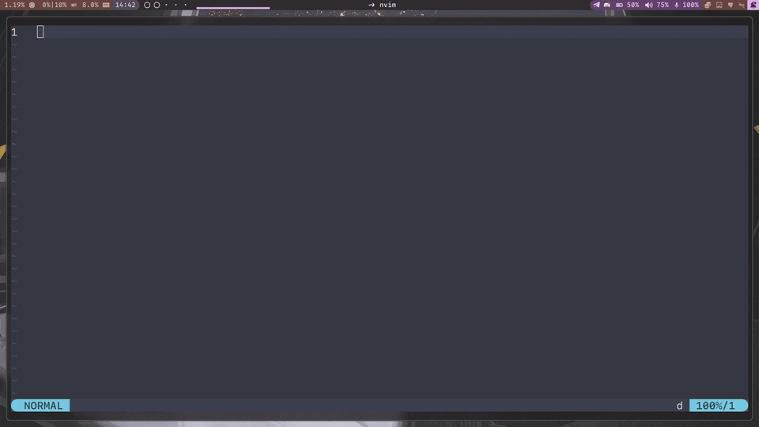

# totp

A minimal TOTP authenticator for Linux. A background daemon keeps your secrets encrypted on disk and generates codes on demand. A CLI lets you import accounts and request clipboard copies. An optional Quickshell panel gives you a searchable visual interface with live countdown timers.



---

## Getting started

### 1. Build

```bash
go build -o totp .
```

Optional install location:

```bash
mkdir -p ~/.local/bin
cp ./totp ~/.local/bin/totp
```

Make sure `~/.local/bin` is in your `PATH`.

### 2. Start the daemon manually

```bash
./totp daemon
```

On the very first run you will be asked once:

```text
Set a passphrase for your master key (press Enter to generate one randomly):
```

- **Press Enter** — a random key is generated for you. Nothing to remember.
- **Type a passphrase** — the key is derived from your passphrase and stored. The passphrase itself is never saved and will never be asked again.

After this one-time setup the daemon starts silently on every subsequent run.

### 3. Import your accounts

See [Importing accounts](#importing-accounts) below.

### 4. Copy a code

```bash
# list your accounts to find the ID
./totp list

# generate the code for an account and copy it to the clipboard
./totp copy <account-id>
```

---

## Running the daemon with systemd

The daemon can copy codes directly to your clipboard. Because of that, it must run inside your active graphical session.

Do **not** start this daemon from `default.target`.

This is wrong:

```ini
[Install]
WantedBy=default.target
```

`default.target` starts too early. At that point your compositor may not have created the session environment yet, so variables like these may be missing:

```text
WAYLAND_DISPLAY
DISPLAY
XDG_RUNTIME_DIR
DBUS_SESSION_BUS_ADDRESS
XDG_CURRENT_DESKTOP
XDG_SESSION_TYPE
```

If those variables are missing, clipboard copying will fail with an error like:

```text
no clipboard backend available: WAYLAND_DISPLAY and DISPLAY are both unset
```

The correct setup is to start the daemon from a compositor/session-owned systemd user target.

---

## Recommended systemd setup

This setup is compositor-agnostic. It works with Hyprland, Sway, River, Niri, Wayfire, Labwc, custom X11 sessions, or desktop environments, as long as you run the startup commands after the graphical session has started.

### 1. Create a session target

Create:

```text
~/.config/systemd/user/totp-session.target
```

with:

```ini
[Unit]
Description=TOTP graphical session
```

This target represents the lifetime of the graphical session that owns the clipboard.

---

### 2. Create the daemon service

Create:

```text
~/.config/systemd/user/totp.service
```

with:

```ini
[Unit]
Description=TOTP authenticator daemon
After=totp-session.target
PartOf=totp-session.target

[Service]
ExecStart=%h/.local/bin/totp daemon
Restart=on-failure
RestartSec=3

[Install]
WantedBy=totp-session.target
```

If your binary is somewhere else, change:

```ini
ExecStart=%h/.local/bin/totp daemon
```

to the correct absolute path.

---

### 3. Enable the service

```bash
systemctl --user daemon-reload
systemctl --user enable totp.service
```

Do **not** use `--now` here.

This service should not start immediately. It should start only when `totp-session.target` starts.

---

### 4. Start the target from your compositor/session autostart

Your compositor or desktop session needs to run these commands after the graphical session environment exists:

```bash
systemctl --user import-environment WAYLAND_DISPLAY DISPLAY XDG_RUNTIME_DIR XDG_CURRENT_DESKTOP XDG_SESSION_TYPE DBUS_SESSION_BUS_ADDRESS
dbus-update-activation-environment --systemd WAYLAND_DISPLAY DISPLAY XDG_RUNTIME_DIR XDG_CURRENT_DESKTOP XDG_SESSION_TYPE DBUS_SESSION_BUS_ADDRESS
systemctl --user start totp-session.target
```

If your compositor supports a shutdown/exit hook, also run this when the compositor exits:

```bash
systemctl --user stop totp-session.target
```

That makes the daemon stop when the graphical session stops.

The startup sequence should be:

```text
compositor starts
  -> compositor creates WAYLAND_DISPLAY or DISPLAY
  -> environment is imported into the user systemd manager
  -> totp-session.target starts
  -> totp.service starts
```

---

## Compositor examples

### Hyprland

Add to `~/.config/hypr/hyprland.conf`:

```ini
exec-once = systemctl --user import-environment WAYLAND_DISPLAY DISPLAY XDG_RUNTIME_DIR XDG_CURRENT_DESKTOP XDG_SESSION_TYPE DBUS_SESSION_BUS_ADDRESS
exec-once = dbus-update-activation-environment --systemd WAYLAND_DISPLAY DISPLAY XDG_RUNTIME_DIR XDG_CURRENT_DESKTOP XDG_SESSION_TYPE DBUS_SESSION_BUS_ADDRESS
exec-once = systemctl --user start totp-session.target

exec-shutdown = systemctl --user stop totp-session.target
```

Then restart Hyprland. Reloading the config is not enough for `exec-once`.

---

### Sway

Add to `~/.config/sway/config`:

```ini
exec systemctl --user import-environment WAYLAND_DISPLAY DISPLAY XDG_RUNTIME_DIR XDG_CURRENT_DESKTOP XDG_SESSION_TYPE DBUS_SESSION_BUS_ADDRESS
exec dbus-update-activation-environment --systemd WAYLAND_DISPLAY DISPLAY XDG_RUNTIME_DIR XDG_CURRENT_DESKTOP XDG_SESSION_TYPE DBUS_SESSION_BUS_ADDRESS
exec systemctl --user start totp-session.target
```

Sway does not provide the same universal shutdown hook as Hyprland. If you need the daemon to stop strictly when Sway exits, start Sway from a wrapper script and stop the target after Sway exits.

Example wrapper:

```bash
#!/usr/bin/env bash
set -e

sway
systemctl --user stop totp-session.target
```

Use that wrapper instead of launching `sway` directly.

---

### Other Wayland compositors

Put this in whatever autostart mechanism your compositor provides:

```bash
systemctl --user import-environment WAYLAND_DISPLAY DISPLAY XDG_RUNTIME_DIR XDG_CURRENT_DESKTOP XDG_SESSION_TYPE DBUS_SESSION_BUS_ADDRESS
dbus-update-activation-environment --systemd WAYLAND_DISPLAY DISPLAY XDG_RUNTIME_DIR XDG_CURRENT_DESKTOP XDG_SESSION_TYPE DBUS_SESSION_BUS_ADDRESS
systemctl --user start totp-session.target
```

If the compositor has an exit hook, run:

```bash
systemctl --user stop totp-session.target
```

on exit.

---

### X11 sessions

For X11, `DISPLAY` is the important variable.

Run this after the X11 session starts:

```bash
systemctl --user import-environment DISPLAY XDG_RUNTIME_DIR XDG_CURRENT_DESKTOP XDG_SESSION_TYPE DBUS_SESSION_BUS_ADDRESS
dbus-update-activation-environment --systemd DISPLAY XDG_RUNTIME_DIR XDG_CURRENT_DESKTOP XDG_SESSION_TYPE DBUS_SESSION_BUS_ADDRESS
systemctl --user start totp-session.target
```

If your window manager has an exit hook, stop the target there:

```bash
systemctl --user stop totp-session.target
```

---

### GNOME, KDE, and desktop environments

Some desktop environments already manage `graphical-session.target`. Some do not expose the exact behavior clearly to user services. The most reliable setup is still the explicit `totp-session.target` shown above.

Use your desktop environment's startup applications UI to run:

```bash
systemctl --user import-environment WAYLAND_DISPLAY DISPLAY XDG_RUNTIME_DIR XDG_CURRENT_DESKTOP XDG_SESSION_TYPE DBUS_SESSION_BUS_ADDRESS && dbus-update-activation-environment --systemd WAYLAND_DISPLAY DISPLAY XDG_RUNTIME_DIR XDG_CURRENT_DESKTOP XDG_SESSION_TYPE DBUS_SESSION_BUS_ADDRESS && systemctl --user start totp-session.target
```

If your desktop environment supports logout scripts, run:

```bash
systemctl --user stop totp-session.target
```

on logout.

---

## Verifying the systemd setup

After logging into your graphical session, check the imported environment:

```bash
systemctl --user show-environment | grep -E 'WAYLAND|DISPLAY|XDG|DBUS'
```

On Wayland, you should see something like:

```text
XDG_RUNTIME_DIR=/run/user/1000
DBUS_SESSION_BUS_ADDRESS=unix:path=/run/user/1000/bus
WAYLAND_DISPLAY=wayland-1
XDG_CURRENT_DESKTOP=Hyprland
XDG_SESSION_TYPE=wayland
```

On X11, you should see something like:

```text
DISPLAY=:0
XDG_SESSION_TYPE=x11
```

Check the target:

```bash
systemctl --user status totp-session.target
```

Check the daemon:

```bash
systemctl --user status totp.service
```

Follow daemon logs:

```bash
journalctl --user -u totp.service -f
```

---

## Troubleshooting systemd startup

### The daemon starts before the compositor

You probably enabled it under `default.target`.

Check:

```bash
find ~/.config/systemd/user -type l -name 'totp.service' -o -name 'totp.path'
```

If you see something like:

```text
~/.config/systemd/user/default.target.wants/totp.service
```

disable it:

```bash
systemctl --user disable --now totp.service
```

Then enable it again using the correct target:

```bash
systemctl --user enable totp.service
```

Expected symlink:

```text
~/.config/systemd/user/totp-session.target.wants/totp.service
```

Not:

```text
~/.config/systemd/user/default.target.wants/totp.service
```

---

### `WAYLAND_DISPLAY` is visible in the terminal but not in the service

Your compositor has the variable, but systemd does not.

Run:

```bash
systemctl --user show-environment | grep WAYLAND_DISPLAY
```

If nothing appears, your autostart did not import the environment correctly.

Run this from inside the graphical session:

```bash
systemctl --user import-environment WAYLAND_DISPLAY DISPLAY XDG_RUNTIME_DIR XDG_CURRENT_DESKTOP XDG_SESSION_TYPE DBUS_SESSION_BUS_ADDRESS
dbus-update-activation-environment --systemd WAYLAND_DISPLAY DISPLAY XDG_RUNTIME_DIR XDG_CURRENT_DESKTOP XDG_SESSION_TYPE DBUS_SESSION_BUS_ADDRESS
systemctl --user restart totp-session.target
```

Then check again:

```bash
systemctl --user show-environment | grep -E 'WAYLAND|DISPLAY|XDG|DBUS'
```

---

### `graphical-session.target` exists but is inactive

That is normal on many standalone compositor setups.

You may see:

```bash
systemctl --user status graphical-session.target
```

return:

```text
Active: inactive (dead)
```

Do not rely on it unless your desktop environment or session manager starts it correctly.

Also, do not try to start it manually. Some systems refuse manual start/stop of `graphical-session.target`.

Use `totp-session.target` instead.

---

### Clipboard still fails

Check that the clipboard tool exists.

For Wayland:

```bash
command -v wl-copy
```

For X11:

```bash
command -v xclip
```

Install the missing tool.

Arch Linux:

```bash
sudo pacman -S wl-clipboard xclip
```

Debian / Ubuntu:

```bash
sudo apt install wl-clipboard xclip
```

Fedora:

```bash
sudo dnf install wl-clipboard xclip
```

---

## Data storage

Your accounts and master key are stored in your home directory:

| File                               | Contents                              |
| ---------------------------------- | ------------------------------------- |
| `~/.local/share/totp/accounts.enc` | Encrypted account store               |
| `~/.local/share/totp/master.key`   | Master key readable only by your user |

Both paths respect `XDG_DATA_HOME` if set.

Your TOTP secrets are encrypted at rest and never leave the daemon.

---

## Importing accounts

### From a QR code image

```bash
./totp import-image ~/Downloads/qr.png
```

Both Google Authenticator export QR codes and standard single-account QR codes are supported.

This requires `zbarimg` to be installed.

Arch Linux:

```bash
sudo pacman -S zbar
```

Debian / Ubuntu:

```bash
sudo apt install zbar-tools
```

Fedora:

```bash
sudo dnf install zbar
```

macOS with Homebrew:

```bash
brew install zbar
```

### From a URI

If you have an `otpauth://totp/` URI, for example from a website's manual entry option, import it directly:

```bash
./totp import-text 'otpauth://totp/Example:alice@example.com?secret=JBSWY3DPEHPK3PXP&issuer=Example'
```

### Re-importing

Importing is safe to run multiple times. Existing accounts are never deleted. If the same account is imported again, it is updated in place.

---

## CLI reference

```bash
totp daemon                  # start the daemon in the foreground
totp status                  # check that the daemon is alive
totp list                    # list accounts as JSON
totp import-image <path>     # import from a QR code image
totp import-text <uri>       # import from an otpauth:// URI
totp copy <id>               # generate a code and copy it to the clipboard
```

---

## Clipboard behavior

`totp copy` asks the daemon to generate a code and copy it to the clipboard.

The daemon chooses a clipboard backend from the environment it received when it started:

| Session detected         | Tool used |
| ------------------------ | --------- |
| `WAYLAND_DISPLAY` is set | `wl-copy` |
| `DISPLAY` is set         | `xclip`   |
| Neither variable is set  | error     |

Because clipboard access belongs to the graphical session, the daemon must be started after the compositor or desktop session has created the correct environment.

---

## Quickshell panel

A visual panel is included in:

```text
ui/shell.qml
```

It requires [Quickshell](https://quickshell.outfoxxed.me).

```bash
qs -p /path/to/totp/ui
```

The panel opens on the right side of the screen and shows all your accounts with a live countdown arc. Type to filter by name, use arrow keys or `j`/`k` to navigate, and press Enter, Space, or click to copy a code.

The panel closes automatically after copying.

The Quickshell panel is optional. The daemon and CLI work fully on their own.

---

## Dependencies

| Dependency                                    | Required for                                  |
| --------------------------------------------- | --------------------------------------------- |
| Go 1.21+                                      | building the project                          |
| `zbarimg` from zbar                           | importing QR code images                      |
| `wl-copy` from wl-clipboard                   | clipboard on Wayland                          |
| `xclip`                                       | clipboard on X11                              |
| `zenity`                                      | file picker in the Quickshell panel, optional |
| [Quickshell](https://quickshell.outfoxxed.me) | the visual panel, optional                    |
